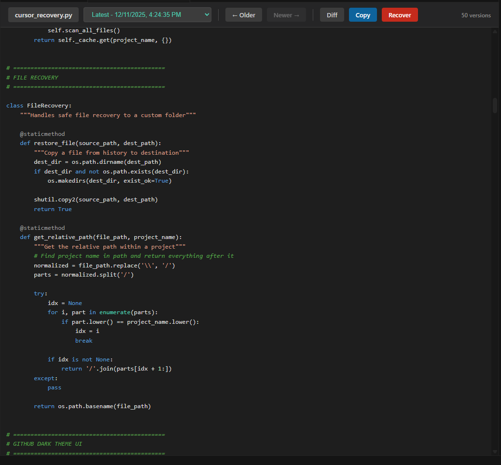
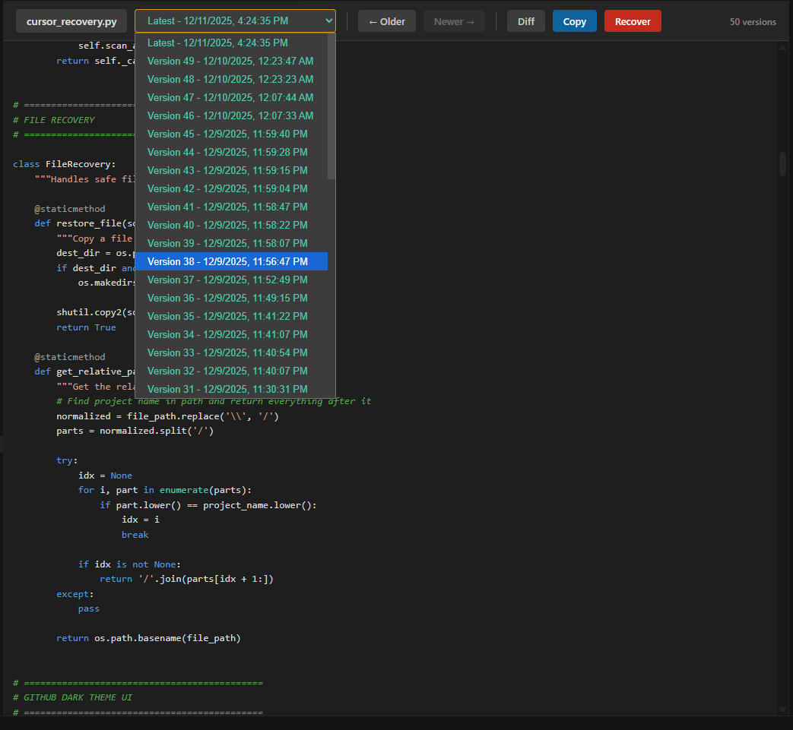
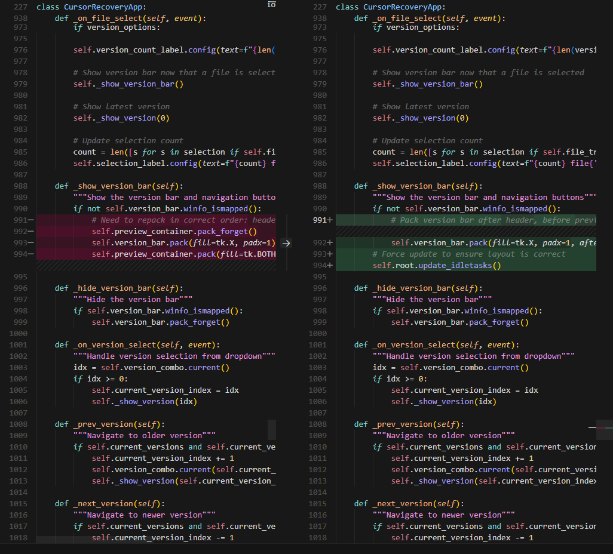

# ✓ Vibe Check

### Git for vibe coders 🚀

Never lose a vibe again! Recover deleted files, browse your coding history, and restore any version of your code from Cursor's local history.

---

## 📸 Screenshots

### Preview with Syntax Highlighting

### Version History Dropdown

### Side-by-Side Diff View

---

## ✨ Features

- 🔍 **Check Your Vibes** - Browse all saved versions of your files
- ⏪ **Time Travel** - Go back to any point in your coding history
- 🔀 **Compare Vibes** - Diff between different versions
- 💾 **Recover Vibes** - Restore files to any location
- 📋 **Copy & Paste** - Copy file contents directly to clipboard
- 📁 **All Projects** - Access history across all your Cursor projects

---

## 🤔 Why Vibe Check?

Ever had that moment when:
- 🗑️ Cursor deleted your files and they're not in recycle bin
- 😱 You accidentally deleted a file
- 🤦 Forgot to commit even when you have Git
- 🧪 Did a quick POC without setting up Git

**Vibe Check has your back!** Cursor automatically saves versions of your files as you code. This extension lets you access that hidden history - no Git required!

---

## 🚀 Quick Start

1. Click the **✓ Vibe Check** icon in the sidebar
2. Select your project
3. Browse your files
4. Click any file to preview
5. Use the toolbar to navigate versions or recover

---

## 🎮 How to Use

### Browse Files
- Open Vibe Check from the Activity Bar (sidebar)
- Select a project from the dropdown
- Expand folders to see files with saved history

### Preview & Navigate
- Click any file to preview with syntax highlighting
- Use **← Older** / **Newer →** to navigate versions
- Use the dropdown to jump to any specific version

### Recover Files
- Click **Recover** to save the file to a new location
- Click **Copy** to copy content to clipboard
- Click **Diff** to compare with the previous version

---

## 💻 Supported Platforms

| Platform | Status |
|----------|--------|
| Windows  | ✅ Supported |
| macOS    | ✅ Supported |
| Linux    | ✅ Supported |

---

## 🔒 Privacy

Vibe Check:
- ✅ Only reads local files on your computer
- ✅ Never sends data anywhere
- ✅ Never modifies Cursor's history files
- ✅ 100% offline - no internet required

---

## 📦 Installation

### From Marketplace
1. Open VS Code / Cursor
2. Go to Extensions (`Ctrl+Shift+X`)
3. Search for **"Vibe Check"**
4. Click **Install**

### From VSIX
1. Download the `.vsix` file
2. Open VS Code / Cursor
3. `Ctrl+Shift+P` → "Install from VSIX"
4. Select the downloaded file

---

## 🛠️ Requirements

- Cursor IDE (to have local history to recover from)
- That's it! No configuration needed.

---

## 🤝 Contributing

Found a bug? Have a feature idea?

[Open an issue](https://github.com/addyfu/vibe-check/issues) or submit a PR!

---

## 📄 License

MIT License - vibe freely! ✌️

---

## 💜 Support

If Vibe Check saved your code, consider:
- ⭐ Starring the repo
- 📢 Sharing with fellow vibe coders
- 🐛 Reporting bugs to help improve

---

**Made with 💜 for the vibe coding community**
